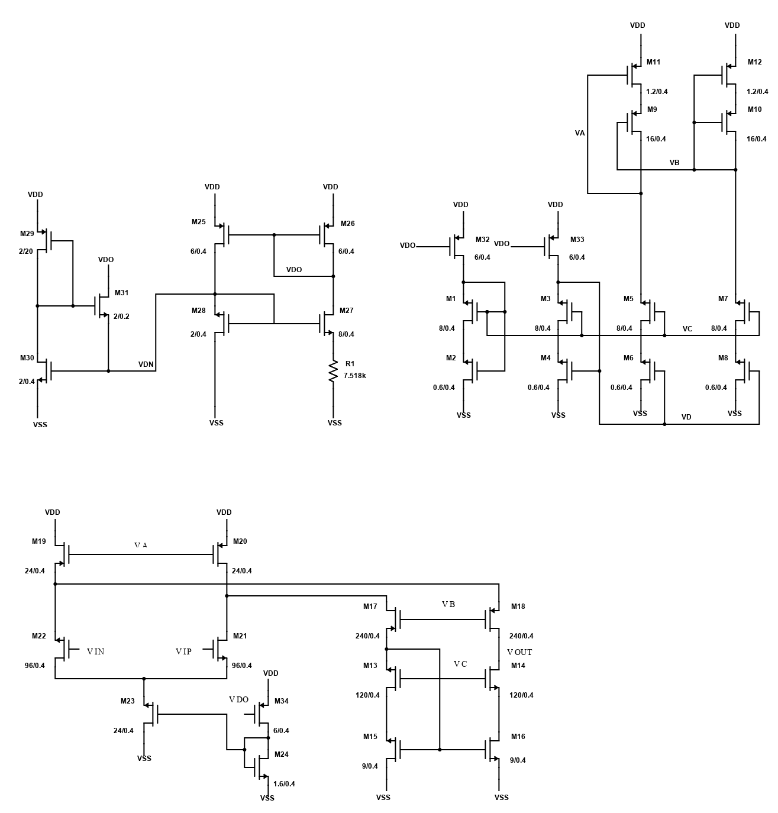

## Self-Biased Folded Cascode OTA

  

This project implements a self-biased folded cascode operational transconductance amplifier (OTA) designed in the Sky130 process. A beta-multiplier reference circuit, located in the upper-left portion of the schematic, is used to generate a stable 10 μA reference current, which serves as the foundation for the entire biasing network. The upper-right section contains the bias generation circuitry, which distributes the required bias voltages and currents to ensure proper transistor operation across the amplifier. The lower part is the folded cascoded OTA core, which can provide high gain and high bandwidth.

### Layout View

You can view the layout online here:

[Open GDS Layout Viewer](https://gds-viewer.tinytapeout.com/?model=https://bingyaowang.github.io/Self-biased-Single-Ended-Folded-Cascoded-OTA/tinytapeout.oas&pdk=sky130A)

### Performance @ Input Common Mode = 1.0 V

| Parameter | Value |
|---|---:|
| DC Gain | 54.2 dB |
| Unity Gain Frequency (UGF) | 28.1 MHz |
| Phase Margin | 86° |

---

### Input Common-Mode Range Sweep

| Input Common Mode (V) | DC Gain | UGF | Status |
|---:|---:|---:|---|
| 0.0 | N/A | N/A | Reject |
| 0.1 | N/A | N/A | Reject |
| 0.2 | N/A | N/A | Reject |
| 0.3 | N/A | N/A | Reject |
| 0.4 | N/A | N/A | Reject |
| 0.5 | N/A | N/A | Reject |
| 0.6 | 23.9 dB | 1.7 MHz | Reject |
| 0.7 | 39.3 dB | 8.4 MHz | Reject |
| 0.8 | 48.3 dB | 17.5 MHz | Reject |
| 0.9 | 53.6 dB | 26.7 MHz | Accept |
| 1.0 | 54.2 dB | 28.1 MHz | Accept |
| 1.1 | 54.6 dB | 29.1 MHz | Accept |
| 1.2 | 54.9 dB | 28.5 MHz | Accept |
| 1.3 | 55.2 dB | 28.8 MHz | Accept |
| 1.4 | 55.5 dB | 30.0 MHz | Accept |
| 1.5 | 55.7 dB | 30.0 MHz | Accept |
| 1.6 | 55.9 dB | 30.0 MHz | Accept |
| 1.7 | 56.0 dB | 31.1 MHz | Accept |
| 1.8 | 56.2 dB | 30.6 MHz | Accept |

---

### Valid Input Common-Mode Range

**0.9 V – 1.8 V**
